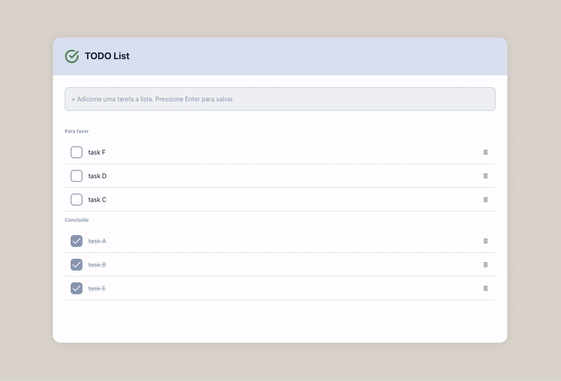

# Code Assessment

[](https://weverton.me)

Development Time

[](https://wakatime.com/badge/user/23a27b6b-815f-4cef-8a6c-21bdf1f9c3ed/project/c0fa8c04-b238-4545-816f-dea1c9189465)

This project is a task management application built with a modern web stack, focusing on modularity and reusability. Below is a breakdown of its structure and features:

### Access the application

this application is available at Vercel, [Click here to access](https://code-assessment-fe.vercel.app/)

### Main Stack

- **[React 19](https://react.dev)**: Used for building the user interface with a component-based architecture.
- **[TypeScript (v5+)](https://www.typescriptlang.org/)**: Provides static typing, improving tooling and preventing common bugs by enforcing types.
- **[Vite (v5+)](https://vite.dev/)**: A fast build tool and development server that optimizes the development experience with features like hot module replacement.
- **[React Router (v7+)](https://reactrouter.com/home)**: Manages client-side routing to navigate between different views of the application, such as HomePage and TodoPage.
- **[Tailwind CSS (v3+)](https://tailwindcss.com/)**: A utility-first CSS framework used to style the application quickly and consistently.
- **[Dnd Kit (v6)](https://github.com/clauderic/dnd-kit)**: Used to implement drag-and-drop functionality, allowing tasks to be reordered interactively.

### Key Features

- **Reusability**: The project is designed with reusable components such as `BoardSection`, `InputCustom`, and `SortableTaskItem`. These self-contained components can be easily reused across different parts of the application.
- **Tests**: The project uses **Vitest** for unit testing to ensure component reliability. Tests for components like `BoardSection`, `InputCustom`, and `SortableTaskItem` validate their behavior. Additionally, tests are run using **Playwright** for end-to-end testing.
- **Context Management**: The `ManageDataContext` manages the state for tasks, providing functions for adding, updating, and reordering tasks. This approach allows the application to scale and maintains a clear separation of concerns. The functions in the context could eventually be replaced with API calls.
- **Drag-and-Drop**: The project includes drag-and-drop functionality using **@dnd-kit/core** and **@dnd-kit/sortable**, enabling users to reorder tasks within sections.
- **Responsive Design**: The application is designed to be responsive, adapting to various screen sizes and orientations. The drag-and-drop functionality is also optimized for touch devices, making it suitable for mobile use.

### Setup Instructions

1. Clone the repository:

```bash
git clone https://github.com/wevertoum/code-assessment-fe.git
```

2. Install the dependencies:

```bash
yarn install
```

3. Run the application:

```bash
yarn dev
```

4. Access the application at `http://localhost:5172`.

### Running tests on Playwright

1. On the root folder, run the following command:

```bash
yarn test
```

### App example in browser



### App example in mobile device


