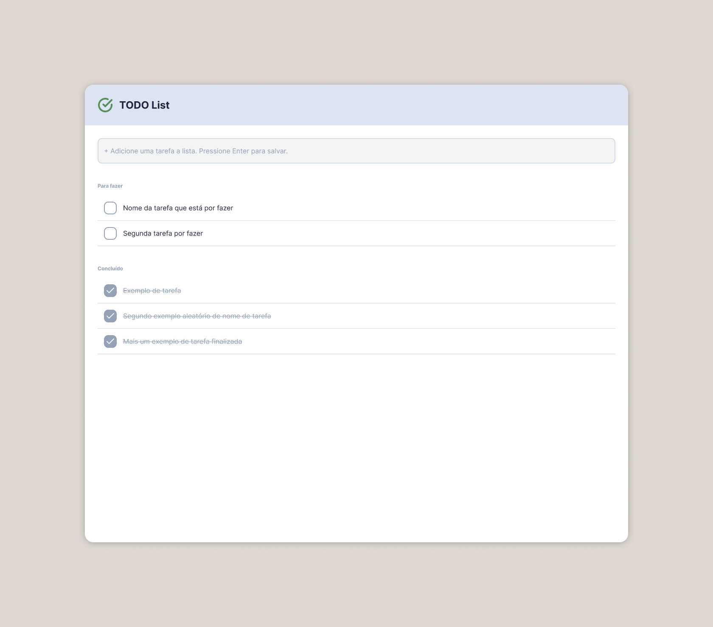

# Frontend Code Assessment - To-Do List Application

## Overview

This repository contains a code challenge for developing a To-Do List web application. The challenge aims to evaluate your frontend development skills, code quality, and attention to design details.

## Design Specifications

- The complete UI design is available in [Figma File](./source/fe-challenge-todo_list.fig).
- The design includes all components, states, and interactions.
- Please ensure pixel-perfect implementation and responsive design.

## Core Features

- Display a list of pending tasks
- Add new tasks to the list
- Edit existing tasks
- Mark tasks as completed
- View completed tasks in a separate list

## Technical Requirements

Required technologies:

- [React 19](https://react.dev)
- [TypeScript (v5+)](https://www.typescriptlang.org/)
- [Vite (v5+)](https://vite.dev/)
- [React Router (v7+)](https://reactrouter.com/home)
- [Tailwind CSS (v3+)](https://tailwindcss.com/)

Additional requirements:

- State management solution (Context API, Zustand, Redux, etc.)
- Unit testing framework (Vitest, Jest, etc.)
- Code formatting (Biomejs or ESLint + Prettier)

## API Integration

While this challenge doesn't require a backend integration, you should structure your code to demonstrate how you would integrate with a REST API.

Create service files that would handle these API calls. You can mock these API calls using local state management and localStorage for persistence.

## Submission Guidelines

- Fork this repository.
- Create a new branch for your implementation.
- Submit your commits.
- Include a README.md with:
  - Setup instructions.
  - Technologies used.
  - Architecture decisions.
  - Any additional features implemented.
- Send your public repository for evaluation by email.

## Bonus Points (Optional)

- Technical

  - Implement drag and drop for task reordering
  - Add E2E tests (Cypress/Playwright)
  - Add error boundaries

- Features

  - Task due dates
  - Task categories/tags

- UX/UI
  - Smooth animations
  - Loading states
  - Error states
  - Empty states

## Time Expectation

- Expected completion time: 5 days
- Please let us know if you need more time.
